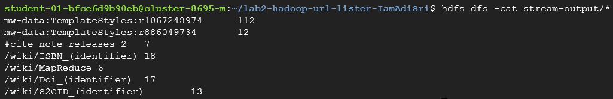

# Lab 2

_Submission by [**Aditya Srivastava**](mailto:aditya.srivastava@colorado.edu) (ID:110578179)._

## Objective

Create a Map-Reduce program to count the number of URLs in the given Wikipedia data.

## Solution

The code can be found in files `URLMapper.py` and `URLReducer.py`. The results are in the `stream-output/` folder. 

The code can be run using the `make stream` command from the root directory.

### Requirements and Specifications

1. Python3
2. Hadoop
3. Hadoop Streaming API (v3.2.3)
4. Google Cloud Platform
	- Dataproc Cluster with up to four E2 machines as workers

### Method

The solution has been implemented in Python3 using the Hadoop Streaming API. There are two main modules - the Mapper and the Reducer.

#### Mapper (`URLMapper.py`)

The script takes inputs from the standard input stream and first splits it on the new line character. Each line is then passed to a function that uses a simple regex pattern to extract URLs from the `href` html attribute.

The mapper then prints each URL found as a `URL_STRING    1` tuple to standard output.

#### Reducer (`URLReducer.py`)

This script takes alphabetically sorted strings from the standard input stream, i.e. the tuples written out by the mapper above. The input is sorted alphabetically before being passed to the reducer, and all tuples with the same URL occur adjacently. The reducer first sums the counts of contiguous sets of URLs. It then checks if the count is greater than 5 and if so, prints the URL and its count to standard output.

#### Output

The output from running the python code on 4 workers is stored in `stream-output/`. A screenshot is provided below.

## Effect of Number of Workers

In the table below we can see the execution times (in seconds) of 2-worker and 4-worker runs;

<table>
  <tr>
    <th></th>
    <th>2 Workers</th>
    <th>4 Workers</th>
  </tr>
  <tr>
    <th>Run #1</th>
    <td align='center'>59.361s</td>
    <td align='center'>40.385s</td>
  </tr>
  <tr>
    <th>Run #2</th>
    <td align='center'>58.017s</td>
    <td align='center'>41.615s</td>
  </tr>
</table>

There is approximately 17.715s (30.17%) reduction in time taken when we double the number of workers. This is an expected outcome due to the increased parallelization of the map and reduce functions over the additional workers.

I initially expected the reduction in time by doubling the number of workers to be closer to 50%, but there still remains some amount of overhead that is incurred regardless of the number of workers, causing the overall time reduction to lessen.

## Effect of Combiner

In the given Java code, the combiner seems to be making no difference on the outputs of the program, although it does seem to be making the program more efficient. The output when running the code without the combiner is the same as running the code with it.

If the operation to be performed (i.e. counting or addition) was not _**commutative**_ or _**associative**_ then the combiner would have caused problems and led to a wrong output. Another scenario where the code might go wrong was if we were to count the tuples themselves instead of the value stored in them, but we are not doing so here.

Thus, there is nothing wrong with the combiner in this case.

___